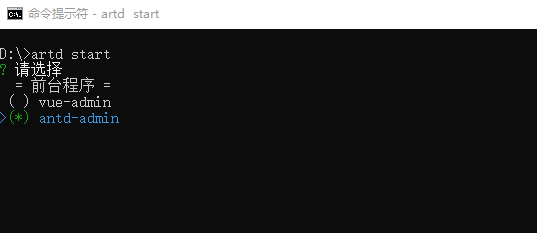

# artd-cli

前端项目构建工具

## 安装

`npm install artd-cli -g`

## 使用

在您需要构建项目的目录， 直接使用命令行 **`artd -s`**                                       
查看帮助 **`artd`或者`artd --help`**                                    
                    
