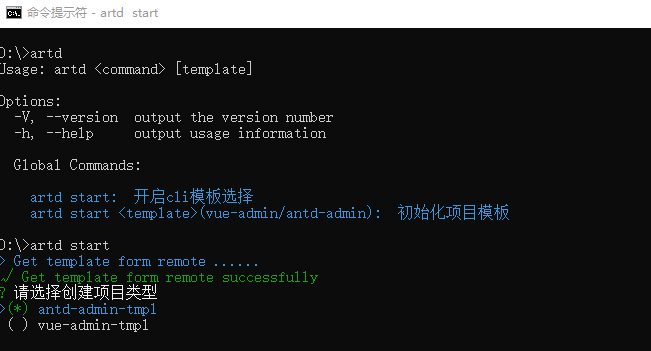

# artd-cli

前端项目构建工具

## 安装

`npm install artd-cli -g`

## 使用

```
artd start -------- 开启cli模板选择

artd start <template>(vue-admin/antd-admin) --------- 初始化项目模板
```                                         
                    
